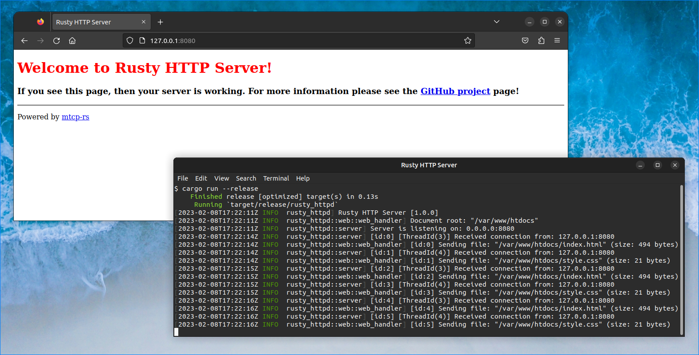

# Rusty HTTP Server

Simple and scalable multi-threaded HTTP server implemented purely in Rust.

This project is heavily based on: [**mtcp-rs**](https://crates.io/crates/mtcp-rs)

## Environment Variables

The following environment variables can be used to configure the server:

- **`HTTP_PUBLIC_PATH`:** The path to serve files from (default: `<exe_path>/public`)
- **`HTTP_BIND_ADDRESS`:** The local IP address where to listen for incoming connections (default: `0.0.0.0`)
- **`HTTP_PORT_NUMBER`:** The port number to listen for incoming connections (default: `8080`)
- **`HTTP_THREADS`:** The number of worker threads (default: detect automatically, one thread per CPU core)
- **`HTTP_TIMEOUT`:** The I/O timeout for HTTP connections, in milliseconds (default: `15000`)
- **`RUST_LOG`:** Controls the log level, see <https://docs.rs/env_logger/latest/env_logger/> for details!

## Supported Platforms

The following platforms are officially supported:

- Microsoft Windows
- Linux
- FreeBSD

These platforms should work too, but are *not* tested extensively:

- OpenBSD
- NetBSD
- DragonFly BSD
- macOS

## License

This is free and unencumbered software released into the public domain.

See [`LICENSE`](LICENSE) file for details!
